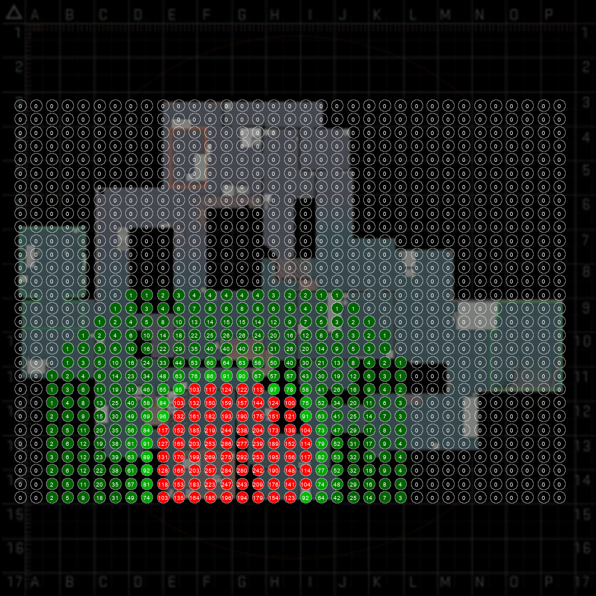
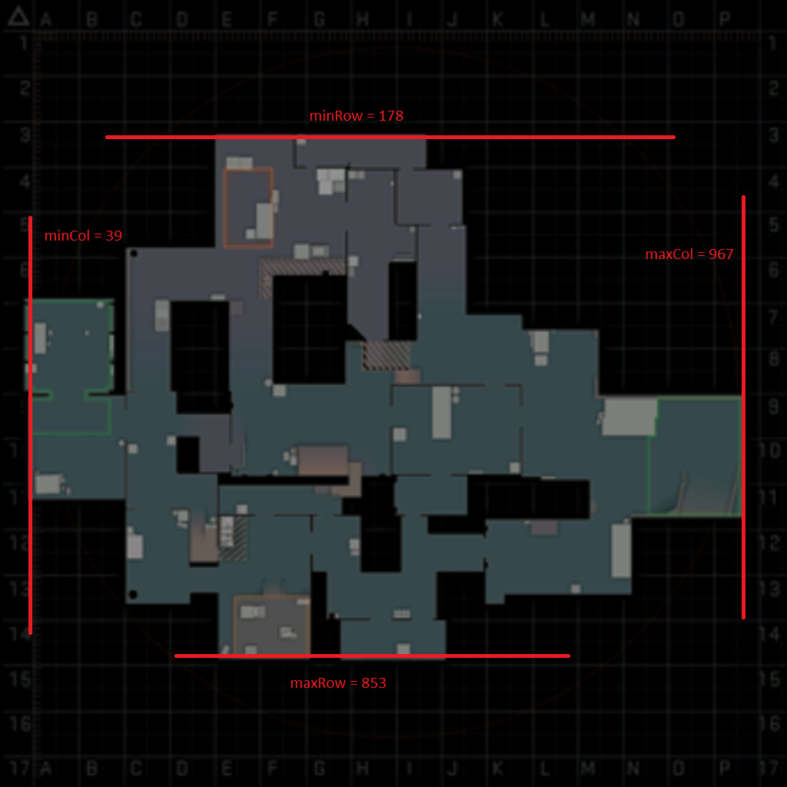

# CSGO bomb blast imager
## Description
Tool that checks the dmg taken by the bomb blast on all points on a grid and represents it on the map radar.  
  
Example result of a 35x30 grid on cache with the bomb in the upper-right corner with kevlar

Based on a the [@csctl](https://github.com/403-Fruit/csctl) project by [@403-Fruit](https://github.com/403-Fruit) to input console commands programmatically over telnet. A big thank you to him !

## Setup
    git clone https://github.com/iCristalrope/CSGO-bomb-blast-imager.git
    cd CSGO-bomb-blast-imager
    pip install -r requirements.txt

## Prerequisites
- Find a clean image of the radar of the map to test (best around 1000x1000 pixels) and save it in the project folder. Set the `radar_img` global var to the image name and set `mapname` too.
- In game use the `noclip` and `cl_showpos 1` commands to fly around and find the minimum X, maximum X, minimum Y and maximum Y values of the smallest rectangle containing all the play area of the map and set `minX`, `maxX`, `minY`, `maxY` accordingly. 
  
- On the radar image find the minimum column, maximum column, minimum row, maximum row (in pixels) of the same play area rectangle and set `radarStartCol`, `radarEndCol`, `radarStartRow`, `radarEndRow` variables accordingly.
  
- Set `gridWidth` and `gridHeight` to specify the density of the grid. Each point takes a bit over 9 seconds so the estimated runtime is `gridWidth` * `gridHeight` * 9 seconds. (35*30 takes almost 3 hours)
- Add all coordinates of where to plant the bomb in the consecutive tests
- Choose whether the terrorist wears kevlar armor or not and set `kevlar` accordingly.

## Usage
Add the following launch option to CS:GO  (remove launch option on next launch)

    -netconport 2121  

Make sure that you are inbounds and noclip is off with

    noclip

Start a game with bots and enter the following commands in the console

    sv_cheats 1;
    mp_startmoney 65000;
    impulse 101;
    mp_buy_anywhere 1;
    mp_buytime 99999999999;
    mp_ignore_round_win_conditions 1;
    cl_showpos 1;

Then these

    sv_infinite_ammo 2;
    ent_fire !self addoutput "health 20000";
    give item_kevlar;
    mp_freezetime 0;
    mp_c4timer 0;
    host_timescale 4.0;
    sv_spawn_afk_bomb_drop_time 999999999999999;
    
Run the python script and make sure it could connect to csgo.
In the console start the mapping with 
    
    echo mapbomb
    
Don't interfere with the process as the console output is used to get data out of the game

# Notes
The game usually crashes after several hours. Different bomb positions may have to be tested one by one.